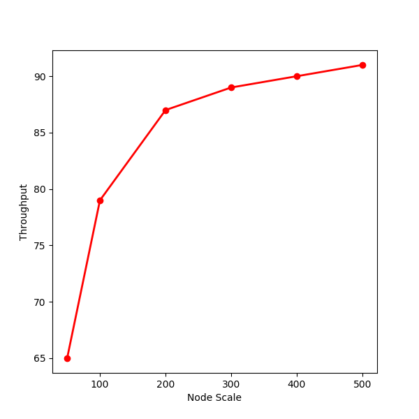

# Simulation_Template
WNDCLab Simulation Template

##  檔案說明
### For Topology
* env.h、env.cpp

    環境的變數設定
*   Edge.h、Edge.cpp

    網路中節點間的邊
*   Node.h、Node.cpp

    網路中的節點
*   Link.h、Link.cpp

    網路中節點間的糾纏鏈結
*   Request.h、Request.cpp

    網路中的請求
*   Runiform_rand.h、Runiform_rand.cpp

    Uniform Random
*   Topo.cpp

    產生網路的Source Code
*   setup.txt

    網路的參數設定
*   Draw_topo_figure.py

    畫出網路的圖
*   Gen_Topo.sh
    
    產生網路的Shell Script

### For Method
*   Simple_Method.cpp

    方法的Source Code
*   Run_Simple.sh

    方法的Shell Script
### For Result
*   Average.cpp

    做平均運算的Source Code
*   Draw_result.py

    畫出結果圖的Source Code

### Others
*   makefile

    建立環境的makefile
*   figures/

    放置README.md使用圖片的資料夾

*   .vscode/

    放置VScode編譯的設定檔案

##  完整實驗流程

1.  編譯程式碼

```
make all
```

2. 產出網路

```
//  sh Gen_Topo.sh #Node_Num #Request_Num #Area #Date
//  MM:01~12, dd:01~31
sh Gen_Topo.sh 100 10 10 MMdd
```
3. 執行方法

```
//  sh Run_Simple.sh #Node_Num #Request_Num #Area #Date
//  MM:01~12, dd:01~31
sh Run_Simple.sh 100 10 10 MMdd
```
4. 重複步驟1~3

由於實驗的結果圖一定是以網路中的某個參數為變數，觀察其變數在變化的過程中，方法的效能變化，因此要根據本身想要的參數與參數變動範圍來去重複以上步驟，如Node 數量[50,100,200,300,400,500]進行變動，所以在結果圖的x軸上就會有6個點。

5. 畫出結果圖

```
//  python3 Draw_result.py #Request_Num #Area #Date
//  MM:01~12, dd:01~31
python3 Draw_result.py 10 10 MMdd
```
